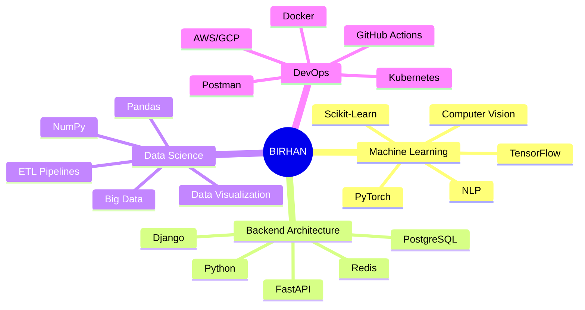

<!-- 
  ██████╗░██╗██████╗░██╗░░██╗░█████╗░███╗░░██╗
  ██╔══██╗██║██╔══██╗██║░░██║██╔══██╗████╗░██║
  ██████╔╝██║██████╔╝███████║██║░░██║██╔██╗██║
  ██╔══██╗██║██╔══██╗██╔══██║██║░░██║██║╚████║
  ██████╔╝██║██║░░██║██║░░██║╚█████╔╝██║░╚███║
  ╚═════╝░╚═╝╚═╝░░╚═╝╚═╝░░╚═╝░╚════╝░╚═╝░░╚══╝
-->

<!-- ═══════════════════════ ULTRA MODERN HEADER ═══════════════════════ -->

  
  <!-- Animated Particles Background -->
  
  
  <!-- Geometric SVG Pattern -->
  <svg width="100%" height="300" viewBox="0 0 1200 300" xmlns="http://www.w3.org/2000/svg">
    <defs>
      <linearGradient id="headerGrad" x1="0%" y1="0%" x2="100%" y2="100%">
        <stop offset="0%" style="stop-color:#ff6b6b;stop-opacity:0.1"/>
        <stop offset="50%" style="stop-color:#4ecdc4;stop-opacity:0.05"/>
        <stop offset="100%" style="stop-color:#45b7d1;stop-opacity:0.1"/>
      </linearGradient>
      <pattern id="hexGrid" width="56" height="100" patternUnits="userSpaceOnUse">
        <path d="M28 66L0 50L0 16L28 0L56 16L56 50L28 66Z" fill="none" stroke="url(#headerGrad)" stroke-width="0.5"/>
        <path d="M28 166L0 150L0 116L28 100L56 116L56 150L28 166Z" fill="none" stroke="url(#headerGrad)" stroke-width="0.5"/>
      </pattern>
    </defs>
    <rect width="1200" height="300" fill="url(#hexGrid)" opacity="0.5"/>
  </svg>
  
  <!-- Main Title with Glitch Effect -->
  

    <h1 style="font-size: 72px; font-weight: 900; background: linear-gradient(135deg, #ff6b6b, #4ecdc4, #45b7d1, #96ceb4); -webkit-background-clip: text; -webkit-text-fill-color: transparent; text-shadow: 2px 2px 4px rgba(0,0,0,0.1); margin: 0; position: relative; display: inline-block;">
      BIRHAN
      BIRHAN
    </h1>
    
    <!-- Subtitle with Typewriter Effect -->
    

      
    

    
    <!-- Floating Tech Badges -->
    

      
        🧬 DEEP LEARNING
      
      
        ⚡ SYSTEMS ARCHITECTURE
      
      
        🔮 DATA ALCHEMY
      
    

  

<!-- Decorative Divider -->

  

<!-- Live Status Bar -->

  <table style="border: none; background: transparent;">
    <tr>
      <td align="center" style="padding: 10px;">
        
      </td>
      <td align="center" style="padding: 10px;">
        
      </td>
      <td align="center" style="padding: 10px;">
        
      </td>
      <td align="center" style="padding: 10px;">
        
      </td>
    </tr>
  </table>

 

<!-- ═══════════════════════ ACHIEVEMENTS SECTION ═══════════════════════ -->

  
  <h2 style="color: #ffd93d; font-family: 'Segoe UI', sans-serif; font-weight: 300; letter-spacing: 3px;">
    ⚜️ ACHIEVEMENT MATRIX ⚜️
  </h2>

  

<!-- ═══════════════════════ SYSTEM IDENTITY ═══════════════════════ -->

  

    
    
      SYSTEM IDENTITY
    
    

 
<!-- ═══════════════════════ TECH STACK ═══════════════════════ -->
 
 

 <h2 style="color: #ffd93d; font-weight: 300; letter-spacing: 5px; margin: 0;"> ⚔️ ARSENAL ⚔️ </h2> 

 
 

 <table style="border: none;"> <tr> <td align="center" width="96">   PYTHON </td> <td align="center" width="96">   TYPESCRIPT </td> <td align="center" width="96">   DOCKER </td> <td align="center" width="96">   KUBERNETES </td> <td align="center" width="96">   AWS </td> <td align="center" width="96">   GITHUB </td> </tr> <tr> <td align="center" width="96">   REACT </td> <td align="center" width="96">   REST API </td> <td align="center" width="96">   GRAPHQL </td> <td align="center" width="96">   MYSQL </td> <td align="center" width="96">   NGINX </td> <td align="center" width="96">   REDIS </td> </tr> </table> 

 <table style="border: none;"> <tr> <td align="center" width="96">   TENSORFLOW </td> <td align="center" width="96">   PYTORCH </td> <td align="center" width="96">   DJANGO </td> <td align="center" width="96">   FASTAPI </td> <td align="center" width="96">   POSTGRES </td> <td align="center" width="96">   FLASK </td> </tr> </table> 

<!-- ═══════════════════════ PERFORMANCE METRICS ═══════════════════════ -->
 
  📊 PERFORMANCE METRICS  
 

   

   

<!-- ═══════════════════════ CONTRIBUTION MATRIX ═══════════════════════ -->
 <h2 style="color: #45b7d1; font-weight: 300; letter-spacing: 4px;"> 🌐 CONTRIBUTION CONSTELLATION </h2> 
<picture> <source media="(prefers-color-scheme: dark)" srcset="https://raw.githubusercontent.com/Birhan121994/Birhan121994/output/github-contribution-grid-snake-dark.svg" /> <source media="(prefers-color-scheme: light)" srcset="https://raw.githubusercontent.com/Birhan121994/Birhan121994/output/github-contribution-grid-snake.svg" />  </picture>
<!-- ═══════════════════════ FEATURED PROJECTS ═══════════════════════ -->
 
 💎  FEATURED PROJECTS  💎 
 

 <table> <tr> <td width="50%"> 
 <h3 style="color: #ff6b6b;">🧠 Neural Nexus</h3> 
Production ML pipeline with auto-scaling
 
    
  
 </td> <td width="50%"> 
 <h3 style="color: #4ecdc4;">📊 DataFlow</h3> 
Real-time ETL & visualization platform
 
    
  
 </td> </tr> <tr> <td width="50%"> 
 <h3 style="color: #45b7d1;">🔐 AuthShield</h3> 
Zero-trust authentication microservice
 
    
  
 </td> <td width="50%"> 
 <h3 style="color: #96ceb4;">🤖 BERT-Sentiment</h3> 
Real-time sentiment analysis API
 
    
  
 </td> </tr> </table> 

<!-- ═══════════════════════ DEV QUOTE ═══════════════════════ -->
  

<!-- ═══════════════════════ CONNECT SECTION ═══════════════════════ -->
 
 

  🌐 ESTABLISH CONNECTION  

 
 

      

<!-- ═══════════════════════ ULTRA MODERN FOOTER ═══════════════════════ -->
 <!-- Animated Wave Footer --> 
  
 <!-- Footer Content Container --> 
 <!-- Holographic Grid Pattern --> 
 <!-- Signature Animation --> 
  BIRHAN  
 <!-- Terminal-Style Typing --> 
 
 

 

 

 
 <code style="color: #4ecdc4; font-family: 'JetBrains Mono', monospace; font-size: 14px;"> ~/birhan/system >  </code> 
 <!-- Glowing Orbit Circles --> 
 

 

 

 

 
 <!-- Status Message --> 
  
 <!-- Copyright with Encryption Style --> 
 <code style="color: #45b7d1; font-size: 11px; opacity: 0.7;"> 🔒 [ENCRYPTED_CHANNEL] © 2024 BIRHAN | ALL RIGHTS RESERVED | BUILT WITH ❤️ & ☕ </code> 
 
 
 <!-- Floating Tech Particles --> 
 
      
 
 
<!-- CSS Animations --><!-- Hidden Easter Egg -->
 <!-- The best code is the one that makes the impossible, possible. --> <!-- If you're reading this, you're part of the 1% who looks deeper. Welcome. --> <!-- 01000010 01001001 01010010 01001000 01000001 01001110 --> 
<!-- ═══════════════════════════════════════════════ DESIGN PHILOSOPHY v2.0: - Neo-minimalist cyberpunk aesthetic - Glass morphism with holographic effects - Hexagonal geometric patterns - Terminal-inspired interactive elements - Glitch text effects for main title - Floating particle animations - Encrypted/cyberpunk status indicators - Organic color flow (coral → turquoise → sky blue → sage) - Dynamic pulse animations on footer - Hidden easter eggs for curious developers ═══════════════════════════════════════════════ -->
