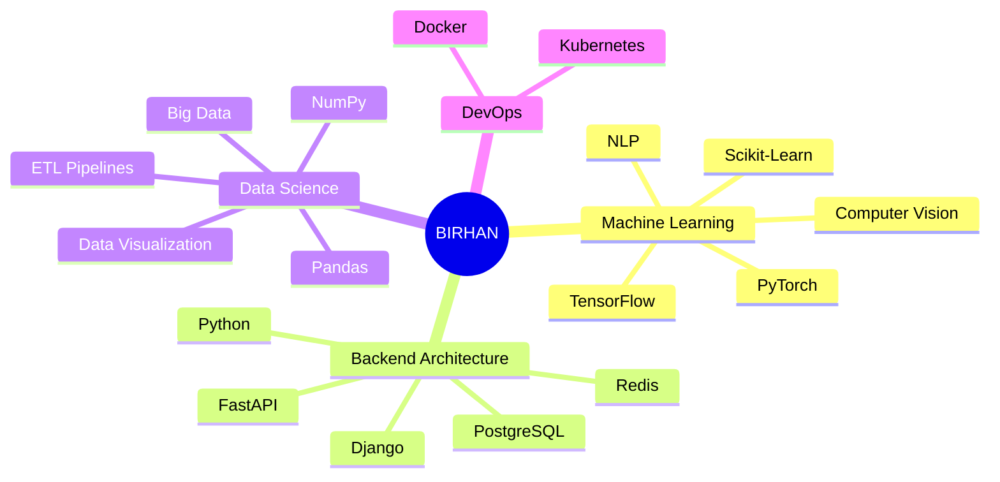

<!-- 
  ██████╗░██╗██████╗░██╗░░██╗░█████╗░███╗░░██╗
  ██╔══██╗██║██╔══██╗██║░░██║██╔══██╗████╗░██║
  ██████╔╝██║██████╔╝███████║██║░░██║██╔██╗██║
  ██╔══██╗██║██╔══██╗██╔══██║██║░░██║██║╚████║
  ██████╔╝██║██║░░██║██║░░██║╚█████╔╝██║░╚███║
  ╚═════╝░╚═╝╚═╝░░╚═╝╚═╝░░╚═╝░╚════╝░╚═╝░░╚══╝
-->

<!-- ============================================ -->
<!-- MODERN HEADER - GLASS MORPHISM WITH PARTICLES -->
<!-- ============================================ -->

  
  <!-- Animated Gradient Background Header -->
  
  
   
  

|  |  |  |
|:---:|:---:|:---:|
| **ML Engineer** | **Solutions Architect** | **Creative Technologist** |
| Deep Learning • NLP • CV | Cloud • Microservices • APIs | UI/UX • Creative Coding • GenAI |
| *Building intelligent systems* | *Designing scalable architectures* | *Crafting digital experiences* |

  

  <!-- Animated Status Line -->
  

    
  

   

  

  
  
  
  
  

 

 

<!-- Minimalist About Section with Neon Theme -->

  <h2>
    
    ✦ 
    SYSTEM IDENTITY
    ✦
  </h2>

<!-- Tech Stack - Minimalist Cards Design -->
 <h2> ✦ TECHNOLOGY STACK ✦ </h2> 

 <table> <tr> <td align="center" width="96" height="96">   <b>Python</b> </td> <td align="center" width="96" height="96">   <b>TypeScript</b> </td> <td align="center" width="96" height="96">   <b>JavaScript</b> </td> <td align="center" width="96" height="96">   <b>React</b> </td> <td align="center" width="96" height="96">   <b>Docker</b> </td> <td align="center" width="96" height="96">   <b>AWS</b> </td> </tr> <tr> <td align="center" width="96" height="96">   <b>GitHub</b> </td> <td align="center" width="96" height="96">   <b>REST API</b> </td> <td align="center" width="96" height="96">   <b>GraphQL</b> </td> <td align="center" width="96" height="96">   <b>K8s</b> </td> <td align="center" width="96" height="96">   <b>Nginx</b> </td> <td align="center" width="96" height="96">   <b>MySQL</b> </td> </tr> </table> 
<!-- ML & Data Science Specific Tools -->
 <table> <tr> <td align="center" width="96" height="96">   <b>TensorFlow</b> </td> <td align="center" width="96" height="96">   <b>PyTorch</b> </td> <td align="center" width="96" height="96">   <b>Django</b> </td> <td align="center" width="96" height="96">   <b>FastAPI</b> </td> <td align="center" width="96" height="96">   <b>Flask</b> </td> <td align="center" width="96" height="96">   <b>PostgreSQL</b> </td> </tr> </table> 
<!-- Stats with Modern Layout -->
 <h2> ✦ PERFORMANCE METRICS ✦ </h2> 

   

   

<!-- Featured Projects - Modern Cards -->
 <h2> ✦ FLAGSHIP PROJECTS ✦ </h2> 

 <table> <tr> <td width="50%"> 
 <h3>🧠 Neural Nexus</h3> 
Production ML pipeline with auto-scaling
 
    
  
 </td> <td width="50%"> 
 <h3>📊 DataFlow</h3> 
Real-time ETL & visualization platform
 
    
  
 </td> </tr> <tr> <td width="50%"> 
 <h3>🔐 AuthShield</h3> 
Zero-trust authentication microservice
 
    
  
 </td> <td width="50%"> 
 <h3>🤖 BERT-Sentiment</h3> 
Real-time sentiment analysis API
 
    
  
 </td> </tr> </table> 

<!-- ============================================ -->
<!-- MODERN FOOTER - ELEGANT & INTERACTIVE -->
<!-- ============================================ -->

<!-- Connect Section with Glass Cards -->

<h2 style="margin: 0 0 10px 0; font-size: 32px; background: linear-gradient(135deg, #667eea 0%, #764ba2 50%, #f093fb 100%); -webkit-background-clip: text; -webkit-text-fill-color: transparent; letter-spacing: 2px;">
✦ LET'S CONNECT ✦
</h2>

<i>"Open to collaborations on innovative AI/ML projects,  
cloud architecture, and open-source contributions."</i>

<!-- ============================================ -->
<!-- MODERN SOCIAL CONNECTION GRID - HORIZONTAL LAYOUT -->
<!-- ============================================ -->

<table align="center" style="border-collapse: collapse; border-spacing: 0; margin: 0 auto;">
<tr>
<td style="padding: 10px;">

<!-- LinkedIn -->
<a href="https://linkedin.com/in/your-linkedin" style="text-decoration:none;">

</a>

</td>
<td style="padding: 10px;">

<!-- Twitter/X -->
<a href="https://twitter.com/your-twitter" style="text-decoration:none;">

</a>

</td>
<td style="padding: 10px;">

<!-- GitHub -->
<a href="https://github.com/Birhan121994" style="text-decoration:none;">

</a>

</td>
<td style="padding: 10px;">

<!-- Email -->
<a href="mailto:your.email@gmail.com" style="text-decoration:none;">

</a>

</td>
<td style="padding: 10px;">

<!-- Portfolio -->
<a href="https://your-portfolio.com" style="text-decoration:none;">

</a>

</td>
</tr>
</table>

 

<!-- Animated Quote Carousel -->

