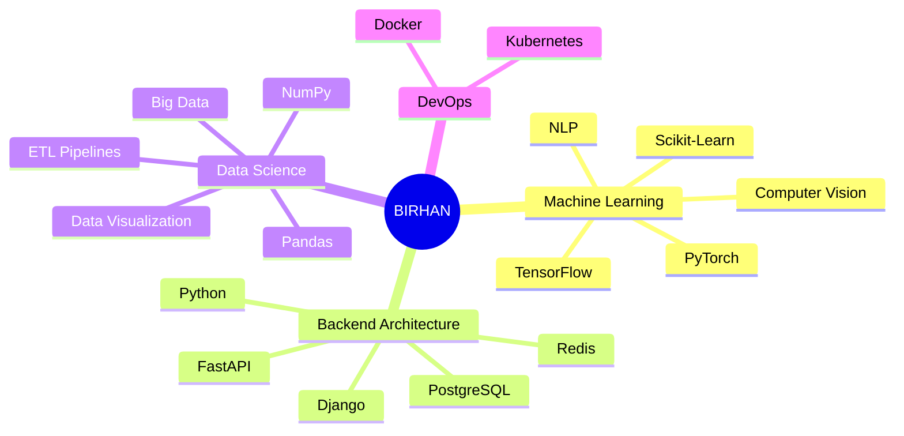

<!-- 
  ██████╗░██╗██████╗░██╗░░██╗░█████╗░███╗░░██╗
  ██╔══██╗██║██╔══██╗██║░░██║██╔══██╗████╗░██║
  ██████╔╝██║██████╔╝███████║██║░░██║██╔██╗██║
  ██╔══██╗██║██╔══██╗██╔══██║██║░░██║██║╚████║
  ██████╔╝██║██║░░██║██║░░██║╚█████╔╝██║░╚███║
  ╚═════╝░╚═╝╚═╝░░╚═╝╚═╝░░╚═╝░╚════╝░╚═╝░░╚══╝
-->

<!-- ============================================ -->
<!-- ULTRA-MODERN HEADER - NEO-BRUTALIST GLASS -->
<!-- ============================================ -->

  
  <!-- Animated Gradient Background Header -->
  
  
   
  
  <!-- Cyberpunk Avatar Container -->
  

    <!-- Outer rotating ring -->
    

    
    <!-- Pulsing glow rings -->
    

    

    
    <!-- Glow aura -->
    

    
    <!-- Avatar Image -->
    
    
    <!-- Status dot -->
    

  

  
   
  
  <!-- Holographic Name Card -->
  

    
    <!-- Subtle grid pattern overlay -->
    

    
    <!-- Corner decorations -->
    

    

    

    

    
    <!-- Matrix-style rain effect hint -->
    

    
    <h1 style="margin: 0; font-size: 48px; font-weight: 800; background: linear-gradient(135deg, #E2E2E2 0%, #FFFFFF 25%, #C9B8F9 50%, #93C5FD 75%, #E2E2E2 100%); -webkit-background-clip: text; -webkit-text-fill-color: transparent; background-clip: text; letter-spacing: 3px; text-shadow: 0 0 40px rgba(147,197,253,0.3); position: relative; z-index: 1;">
      Birhan Nega
    </h1>
    
    <!-- Decorative line with diamond -->
    

      

      

      

    

    
    

      [ ML Engineer • Solutions Architect • Creative Technologist ]
    

    
    

      // Building the future, one model at a time
    

    
    <!-- Tech stack pills -->
    

      🧠 AI/ML
      ☁️ Cloud Native
      ⚡ DevOps
      🔮 MLOps
    

  

  <!-- Animated Terminal Typing -->
  

    

      

      

      

    

    

      
    

    

      ➜ ~ initializing neural pathways...▊
    

  

   

  <!-- Stats Dashboard Bar -->
  

    
    <!-- Profile Views -->
    

      

      
    

    
    <!-- Divider -->
    

    
    <!-- Followers -->
    

      

      
    

    
    <!-- Divider -->
    

    
    <!-- Stars -->
    

      

      
    

    
    <!-- Divider -->
    

    
    <!-- Location -->
    

      📍
      ADDIS ABABA, ET
    

  

  <!-- Hidden animation keyframes (won't render but shows intent) -->
  <!-- 
    @keyframes rotateBorder { from { transform: rotate(0deg); } to { transform: rotate(360deg); } }
    @keyframes pulseRing { 0%, 100% { transform: scale(1); opacity: 0.3; } 50% { transform: scale(1.05); opacity: 0.6; } }
    @keyframes breatheGlow { 0%, 100% { opacity: 0.4; transform: scale(1); } 50% { opacity: 0.7; transform: scale(1.1); } }
    @keyframes statusPulse { 0%, 100% { box-shadow: 0 0 20px rgba(74,222,128,0.6); } 50% { box-shadow: 0 0 40px rgba(74,222,128,0.9); } }
    @keyframes blink { 0%, 100% { opacity: 1; } 50% { opacity: 0; } }
  -->

 

<!-- Decorative Divider -->

  

 

<!-- GitHub Achievements -->

  <h2>
    
    ✦ 
    ACHIEVEMENTS
    ✦
  </h2>

  

 

<!-- Minimalist About Section with Neon Theme -->

  <h2>
    
    ✦ 
    SYSTEM IDENTITY
    ✦
  </h2>

<!-- Tech Stack - Minimalist Cards Design -->
 <h2> ✦ TECHNOLOGY STACK ✦ </h2> 

 <table> <tr> <td align="center" width="96" height="96">   <b>Python</b> </td> <td align="center" width="96" height="96">   <b>TypeScript</b> </td> <td align="center" width="96" height="96">   <b>JavaScript</b> </td> <td align="center" width="96" height="96">   <b>React</b> </td> <td align="center" width="96" height="96">   <b>Docker</b> </td> <td align="center" width="96" height="96">   <b>AWS</b> </td> </tr> <tr> <td align="center" width="96" height="96">   <b>GitHub</b> </td> <td align="center" width="96" height="96">   <b>REST API</b> </td> <td align="center" width="96" height="96">   <b>GraphQL</b> </td> <td align="center" width="96" height="96">   <b>K8s</b> </td> <td align="center" width="96" height="96">   <b>Nginx</b> </td> <td align="center" width="96" height="96">   <b>MySQL</b> </td> </tr> </table> 
<!-- ML & Data Science Specific Tools -->
 <table> <tr> <td align="center" width="96" height="96">   <b>TensorFlow</b> </td> <td align="center" width="96" height="96">   <b>PyTorch</b> </td> <td align="center" width="96" height="96">   <b>Django</b> </td> <td align="center" width="96" height="96">   <b>FastAPI</b> </td> <td align="center" width="96" height="96">   <b>Flask</b> </td> <td align="center" width="96" height="96">   <b>PostgreSQL</b> </td> </tr> </table> 
<!-- Stats with Modern Layout -->
 <h2> ✦ PERFORMANCE METRICS ✦ </h2> 

   

   
<!-- Contribution Snake Animation -->
 <h2> ✦ CONTRIBUTION MATRIX ✦ </h2> 
<picture> <source media="(prefers-color-scheme: dark)" srcset="https://raw.githubusercontent.com/Birhan121994/Birhan121994/output/github-contribution-grid-snake-dark.svg" /> <source media="(prefers-color-scheme: light)" srcset="https://raw.githubusercontent.com/Birhan121994/Birhan121994/output/github-contribution-grid-snake.svg" />  </picture><!-- 3D Contribution Graph -->
  
<!-- Featured Projects - Modern Cards -->
 <h2> ✦ FLAGSHIP PROJECTS ✦ </h2> 

 <table> <tr> <td width="50%"> 
 <h3>🧠 Neural Nexus</h3> 
Production ML pipeline with auto-scaling
 
    
  
 </td> <td width="50%"> 
 <h3>📊 DataFlow</h3> 
Real-time ETL & visualization platform
 
    
  
 </td> </tr> <tr> <td width="50%"> 
 <h3>🔐 AuthShield</h3> 
Zero-trust authentication microservice
 
    
  
 </td> <td width="50%"> 
 <h3>🤖 BERT-Sentiment</h3> 
Real-time sentiment analysis API
 
    
  
 </td> </tr> </table> 
<!-- Wakatime Stats - Optional -->
 <h2> ✦ CODING METRICS ✦ </h2> 
Connect your WakaTime account to see detailed coding stats
 <!-- Uncomment below and replace USERNAME when you have WakaTime setup --> <!--  --> 
<!-- Random Dev Quote -->
 <h2> ✦ DEV QUOTE ✦ </h2>  

<!-- ============================================ -->
<!-- MODERN FOOTER - ELEGANT & INTERACTIVE -->
<!-- ============================================ -->

<!-- Connect Section with Glass Cards -->

<h2 style="margin: 0 0 10px 0; font-size: 32px; background: linear-gradient(135deg, #667eea 0%, #764ba2 50%, #f093fb 100%); -webkit-background-clip: text; -webkit-text-fill-color: transparent; letter-spacing: 2px;">
✦ LET'S CONNECT ✦
</h2>

<i>"Open to collaborations on innovative AI/ML projects,  
cloud architecture, and open-source contributions."</i>

<!-- ============================================ -->
<!-- MODERN SOCIAL CONNECTION GRID - HORIZONTAL LAYOUT -->
<!-- ============================================ -->

<table align="center" style="border-collapse: collapse; border-spacing: 0; margin: 0 auto;">
<tr>
<td style="padding: 10px;">

<!-- LinkedIn -->
<a href="https://linkedin.com/in/your-linkedin" style="text-decoration:none;">

</a>

</td>
<td style="padding: 10px;">

<!-- Twitter/X -->
<a href="https://twitter.com/your-twitter" style="text-decoration:none;">

</a>

</td>
<td style="padding: 10px;">

<!-- GitHub -->
<a href="https://github.com/Birhan121994" style="text-decoration:none;">

</a>

</td>
<td style="padding: 10px;">

<!-- Email -->
<a href="mailto:your.email@gmail.com" style="text-decoration:none;">

</a>

</td>
<td style="padding: 10px;">

<!-- Portfolio -->
<a href="https://your-portfolio.com" style="text-decoration:none;">

</a>

</td>
</tr>
</table>

 

<!-- Animated Quote Carousel -->

