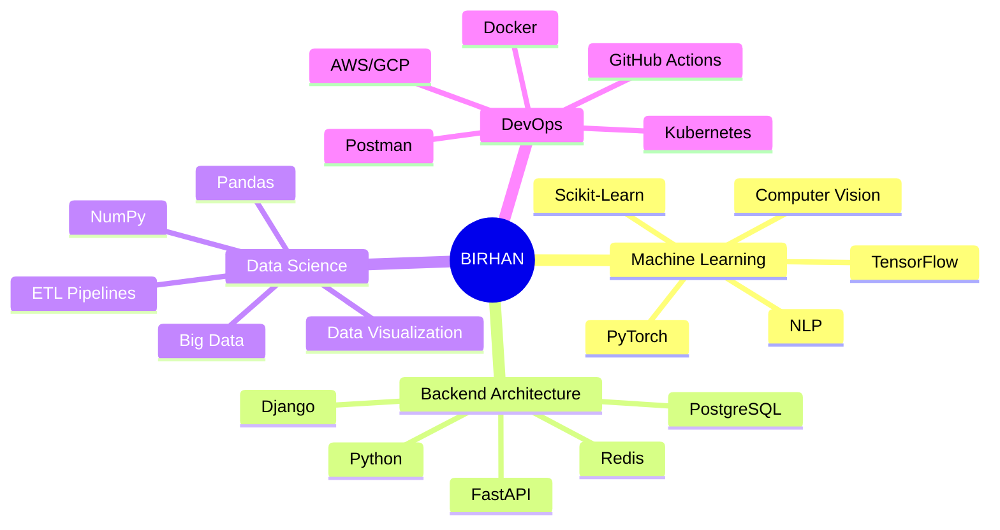

<!-- 
  ██████╗░██╗██████╗░██╗░░██╗░█████╗░███╗░░██╗
  ██╔══██╗██║██╔══██╗██║░░██║██╔══██╗████╗░██║
  ██████╔╝██║██████╔╝███████║██║░░██║██╔██╗██║
  ██╔══██╗██║██╔══██╗██╔══██║██║░░██║██║╚████║
  ██████╔╝██║██║░░██║██║░░██║╚█████╔╝██║░╚███║
  ╚═════╝░╚═╝╚═╝░░╚═╝╚═╝░░╚═╝░╚════╝░╚═╝░░╚══╝
-->

  

<!-- Matrix Digital Rain Effect Title -->

  

<!-- Glowing Line Divider -->

  

<!-- Profile Stats with Glass Morphism -->

  <table>
    <tr>
      <td>
        
      </td>
      <td>
        
      </td>
      <td>
        
      </td>
    </tr>
  </table>

 

<!-- GitHub Achievements -->

  <h2>
    
    ✦ 
    ACHIEVEMENTS
    ✦
  </h2>

  

 

<!-- Minimalist About Section with Neon Theme -->

  <h2>
    
    ✦ 
    SYSTEM IDENTITY
    ✦
  </h2>

<!-- Tech Stack - Minimalist Cards Design -->
 <h2> ✦ TECHNOLOGY STACK ✦ </h2> 

 <table> <tr> <td align="center" width="96" height="96">   <b>Python</b> </td> <td align="center" width="96" height="96">   <b>TypeScript</b> </td> <td align="center" width="96" height="96">   <b>JavaScript</b> </td> <td align="center" width="96" height="96">   <b>React</b> </td> <td align="center" width="96" height="96">   <b>Docker</b> </td> <td align="center" width="96" height="96">   <b>AWS</b> </td> </tr> <tr> <td align="center" width="96" height="96">   <b>GitHub</b> </td> <td align="center" width="96" height="96">   <b>REST API</b> </td> <td align="center" width="96" height="96">   <b>GraphQL</b> </td> <td align="center" width="96" height="96">   <b>K8s</b> </td> <td align="center" width="96" height="96">   <b>Nginx</b> </td> <td align="center" width="96" height="96">   <b>MySQL</b> </td> </tr> </table> 

<!-- ML & Data Science Specific Tools -->
 <table> <tr> <td align="center" width="96" height="96">   <b>TensorFlow</b> </td> <td align="center" width="96" height="96">   <b>PyTorch</b> </td> <td align="center" width="96" height="96">   <b>Django</b> </td> <td align="center" width="96" height="96">   <b>FastAPI</b> </td> <td align="center" width="96" height="96">   <b>Flask</b> </td> <td align="center" width="96" height="96">   <b>PostgreSQL</b> </td> </tr> </table> 

<!-- Stats with Modern Layout -->
 <h2> ✦ PERFORMANCE METRICS ✦ </h2> 

   

   

<!-- Contribution Snake Animation -->
 <h2> ✦ CONTRIBUTION MATRIX ✦ </h2> 
<picture> <source media="(prefers-color-scheme: dark)" srcset="https://raw.githubusercontent.com/Birhan121994/Birhan121994/output/github-contribution-grid-snake-dark.svg" /> <source media="(prefers-color-scheme: light)" srcset="https://raw.githubusercontent.com/Birhan121994/Birhan121994/output/github-contribution-grid-snake.svg" />  </picture>
<!-- 3D Contribution Graph -->
  

<!-- Featured Projects - Modern Cards -->
 <h2> ✦ FLAGSHIP PROJECTS ✦ </h2> 

 <table> <tr> <td width="50%"> 
 <h3>🧠 Neural Nexus</h3> 
Production ML pipeline with auto-scaling
 
    
  
 </td> <td width="50%"> 
 <h3>📊 DataFlow</h3> 
Real-time ETL & visualization platform
 
    
  
 </td> </tr> <tr> <td width="50%"> 
 <h3>🔐 AuthShield</h3> 
Zero-trust authentication microservice
 
    
  
 </td> <td width="50%"> 
 <h3>🤖 BERT-Sentiment</h3> 
Real-time sentiment analysis API
 
    
  
 </td> </tr> </table> 

<!-- Wakatime Stats - Optional -->
 <h2> ✦ CODING METRICS ✦ </h2> 
Connect your WakaTime account to see detailed coding stats
 <!-- Uncomment below and replace USERNAME when you have WakaTime setup --> <!--  --> 

<!-- Random Dev Quote -->
 <h2> ✦ DEV QUOTE ✦ </h2>  

<!-- Connect Section - Modern Icons -->
 <h2> ✦ CONNECT ✦ </h2> 

      

<!-- Animated Footer -->
  

 
  
 
  
 
<!-- ═══════════════════════════════════════════════ DESIGN PHILOSOPHY: - Modern glass morphism effects - Neon cyberpunk color palette - Dynamic 3D contribution graphs - Interactive tech stack with animated icons - GitHub achievements and trophies - Mermaid.js mindmap for structure - Dynamic typing animations - Gradient text effects - Random dev quotes for inspiration ═══════════════════════════════════════════════ -->
