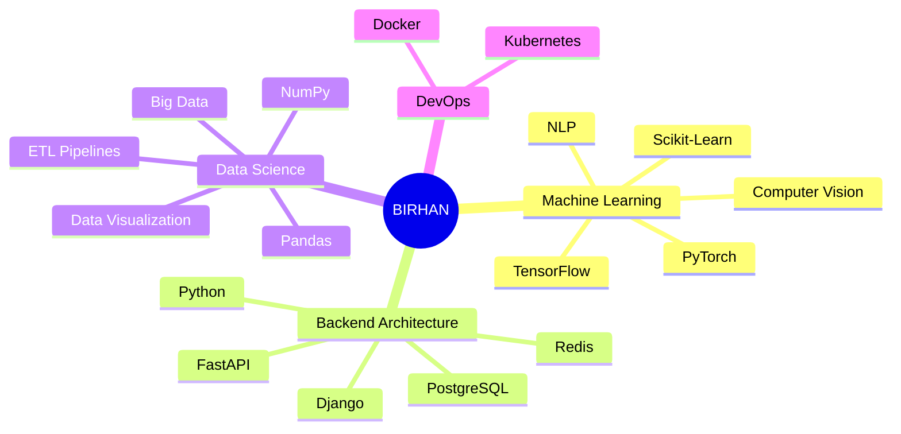

<!-- 
  ██████╗░██╗██████╗░██╗░░██╗░█████╗░███╗░░██╗
  ██╔══██╗██║██╔══██╗██║░░██║██╔══██╗████╗░██║
  ██████╔╝██║██████╔╝███████║██║░░██║██╔██╗██║
  ██╔══██╗██║██╔══██╗██╔══██║██║░░██║██║╚████║
  ██████╔╝██║██║░░██║██║░░██║╚█████╔╝██║░╚███║
  ╚═════╝░╚═╝╚═╝░░╚═╝╚═╝░░╚═╝░╚════╝░╚═╝░░╚══╝
-->

<!-- ============================================ -->
<!-- MODERN HEADER - GLASS MORPHISM WITH PARTICLES -->
<!-- ============================================ -->

  
  <!-- Animated Gradient Background Header -->
  
  
   
  
  <!-- Animated Avatar with Glow Effect -->
  

    

    
  

  
   
  
  <!-- Elegant Name Typography -->
  

    <h1 style="margin: 0; font-size: 42px; background: linear-gradient(135deg, #E2E2E2 0%, #FFFFFF 30%, #C9B8F9 60%, #93C5FD 100%); -webkit-background-clip: text; -webkit-text-fill-color: transparent; letter-spacing: 2px;">
      Birhan Nega
    </h1>
    

    

      ML Engineer • Solutions Architect • Creative Technologist
    

    

      🤖 AI/ML
      ☁️ Cloud
      🔧 DevOps
    

  

  <!-- Animated Status Line -->
  

    
  

   

  <!-- Floating Social & Stats Bar -->
  

    
    |
    
    |
    
    |
    📍 Addis Ababa, Ethiopia
  

 

<!-- Decorative Divider -->

  

 

<!-- GitHub Achievements -->

  <h2>
    
    ✦ 
    ACHIEVEMENTS
    ✦
  </h2>

  

 

<!-- Minimalist About Section with Neon Theme -->

  <h2>
    
    ✦ 
    SYSTEM IDENTITY
    ✦
  </h2>

<!-- Tech Stack - Minimalist Cards Design -->
 <h2> ✦ TECHNOLOGY STACK ✦ </h2> 

 <table> <tr> <td align="center" width="96" height="96">   <b>Python</b> </td> <td align="center" width="96" height="96">   <b>TypeScript</b> </td> <td align="center" width="96" height="96">   <b>JavaScript</b> </td> <td align="center" width="96" height="96">   <b>React</b> </td> <td align="center" width="96" height="96">   <b>Docker</b> </td> <td align="center" width="96" height="96">   <b>AWS</b> </td> </tr> <tr> <td align="center" width="96" height="96">   <b>GitHub</b> </td> <td align="center" width="96" height="96">   <b>REST API</b> </td> <td align="center" width="96" height="96">   <b>GraphQL</b> </td> <td align="center" width="96" height="96">   <b>K8s</b> </td> <td align="center" width="96" height="96">   <b>Nginx</b> </td> <td align="center" width="96" height="96">   <b>MySQL</b> </td> </tr> </table> 
<!-- ML & Data Science Specific Tools -->
 <table> <tr> <td align="center" width="96" height="96">   <b>TensorFlow</b> </td> <td align="center" width="96" height="96">   <b>PyTorch</b> </td> <td align="center" width="96" height="96">   <b>Django</b> </td> <td align="center" width="96" height="96">   <b>FastAPI</b> </td> <td align="center" width="96" height="96">   <b>Flask</b> </td> <td align="center" width="96" height="96">   <b>PostgreSQL</b> </td> </tr> </table> 
<!-- Stats with Modern Layout -->
 <h2> ✦ PERFORMANCE METRICS ✦ </h2> 

   

   
<!-- Contribution Snake Animation -->
 <h2> ✦ CONTRIBUTION MATRIX ✦ </h2> 
<picture> <source media="(prefers-color-scheme: dark)" srcset="https://raw.githubusercontent.com/Birhan121994/Birhan121994/output/github-contribution-grid-snake-dark.svg" /> <source media="(prefers-color-scheme: light)" srcset="https://raw.githubusercontent.com/Birhan121994/Birhan121994/output/github-contribution-grid-snake.svg" />  </picture><!-- 3D Contribution Graph -->
  
<!-- Featured Projects - Modern Cards -->
 <h2> ✦ FLAGSHIP PROJECTS ✦ </h2> 

 <table> <tr> <td width="50%"> 
 <h3>🧠 Neural Nexus</h3> 
Production ML pipeline with auto-scaling
 
    
  
 </td> <td width="50%"> 
 <h3>📊 DataFlow</h3> 
Real-time ETL & visualization platform
 
    
  
 </td> </tr> <tr> <td width="50%"> 
 <h3>🔐 AuthShield</h3> 
Zero-trust authentication microservice
 
    
  
 </td> <td width="50%"> 
 <h3>🤖 BERT-Sentiment</h3> 
Real-time sentiment analysis API
 
    
  
 </td> </tr> </table> 
<!-- Wakatime Stats - Optional -->
 <h2> ✦ CODING METRICS ✦ </h2> 
Connect your WakaTime account to see detailed coding stats
 <!-- Uncomment below and replace USERNAME when you have WakaTime setup --> <!--  --> 
<!-- Random Dev Quote -->
 <h2> ✦ DEV QUOTE ✦ </h2>  

<!-- ============================================ -->
<!-- MODERN FOOTER - ELEGANT & INTERACTIVE -->
<!-- ============================================ -->

<!-- Connect Section with Glass Cards -->

<h2 style="margin: 0 0 10px 0; font-size: 32px; background: linear-gradient(135deg, #667eea 0%, #764ba2 50%, #f093fb 100%); -webkit-background-clip: text; -webkit-text-fill-color: transparent; letter-spacing: 2px;">
✦ LET'S CONNECT ✦
</h2>

<i>"Open to collaborations on innovative AI/ML projects,  
cloud architecture, and open-source contributions."</i>

<!-- ============================================ -->
<!-- MODERN SOCIAL CONNECTION GRID - ENHANCED UI -->
<!-- ============================================ -->

<!-- LinkedIn -->
<a href="https://linkedin.com/in/your-linkedin" style="text-decoration:none; position:relative;">

💼

LinkedIn

Connect

</a>

<!-- Twitter/X -->
<a href="https://twitter.com/your-twitter" style="text-decoration:none; position:relative;">

🐦

Twitter

Follow

</a>

<!-- GitHub -->
<a href="https://github.com/Birhan121994" style="text-decoration:none; position:relative;">

🐙

GitHub

Star

</a>

<!-- Email -->
<a href="mailto:your.email@gmail.com" style="text-decoration:none; position:relative;">

📧

Email

Message

</a>

<!-- Portfolio -->
<a href="https://your-portfolio.com" style="text-decoration:none; position:relative;">

🌐

Portfolio

Visit

</a>

 

<!-- Animated Quote Carousel -->

